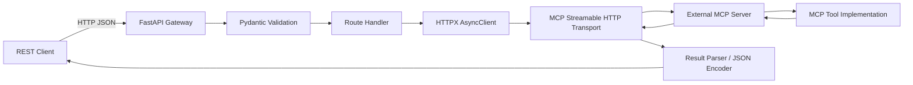
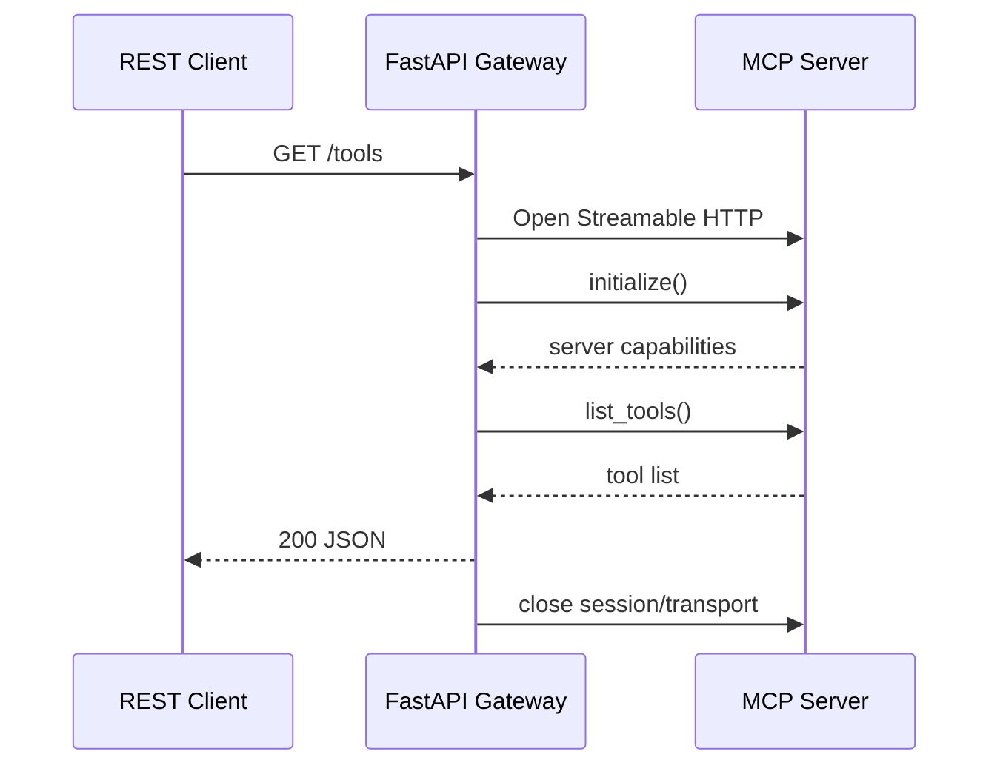
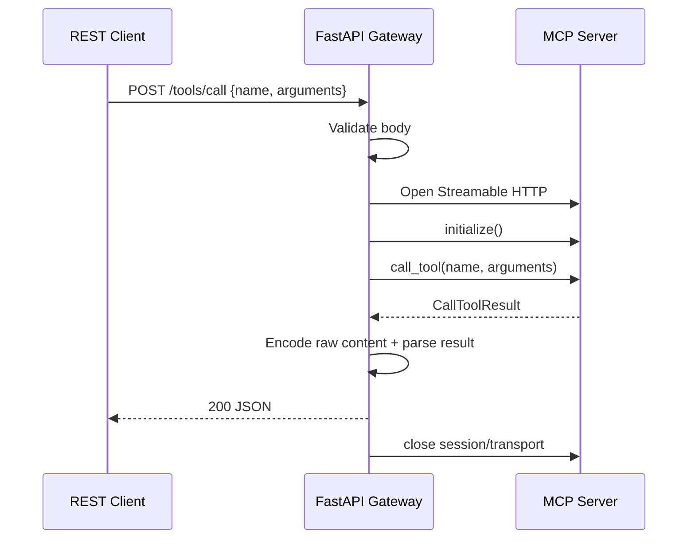
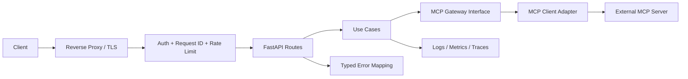

# Blueprint Rekonstruksi MCP Client Gateway

## 1. Tujuan Dokumen

Dokumen ini adalah spesifikasi untuk membangun ulang sistem pada repository ini menggunakan Codex. Isinya disusun dari source code, konfigurasi, dependency terpasang, riwayat Git, dan validasi aplikasi secara in-process pada 23 Juni 2026.

Ada dua target yang harus dibedakan:

1. **Compatibility build**: mereplikasi perilaku aplikasi saat ini sedekat mungkin.
2. **Production build**: mempertahankan fungsi bisnis yang sama, tetapi menambahkan struktur, keamanan, observability, pengujian, dan deployment yang layak.

Repository ini hanya berisi **REST-to-MCP client gateway**. Repository ini tidak berisi MCP server, implementasi tool `simulate_router_path`, data router/topologi, database, frontend, maupun reverse proxy. Komponen tersebut harus tersedia secara eksternal atau dibuat sebagai proyek terpisah.

---

## 2. Ringkasan Sistem Saat Ini

### Fungsi utama

Aplikasi menyediakan REST API berbasis FastAPI yang menerjemahkan request HTTP biasa menjadi operasi MCP melalui transport Streamable HTTP.

Fungsi yang tersedia:

- Menampilkan status proses gateway melalui `GET /health`.
- Menampilkan daftar tool dari MCP server melalui `GET /tools`.
- Memanggil tool MCP apa pun melalui `POST /tools/call`.
- Menyediakan shortcut khusus untuk tool `simulate_router_path` melalui `POST /simulate-path`.
- Menormalisasi hasil tool menjadi bentuk `structured` atau fallback `text`.

### Karakteristik runtime

- Bahasa: Python 3.10.
- Web framework: FastAPI.
- ASGI server: Uvicorn.
- MCP SDK: package Python `mcp`.
- HTTP client: HTTPX.
- Validasi request: Pydantic.
- Konfigurasi: environment variable dan file `.env`.
- State: stateless; tidak ada database, cache, file persistence, atau session aplikasi.
- Koneksi: satu `httpx.AsyncClient`, satu transport MCP, dan satu `ClientSession` baru untuk setiap operasi MCP.
- API documentation bawaan FastAPI tersedia di `/docs`, `/redoc`, dan `/openapi.json`.

### Inventaris source

| Artefak | Fungsi | Catatan |
|---|---|---|
| `app.py` | Seluruh model, koneksi MCP, parsing hasil, route, dan entry point | 177 baris; monolitik tetapi sederhana |
| `requirements.txt` | Daftar enam dependency langsung | Belum memakai version pin |
| `.env` | Empat konfigurasi runtime | Saat ini ikut terlacak Git; jangan ditiru |
| `.venv/` | Virtual environment lokal | Saat ini ikut terlacak Git; jangan ditiru |
| `__pycache__/` | Bytecode Python | Saat ini ikut terlacak Git; jangan ditiru |

Dependency langsung:

```text
fastapi
uvicorn
mcp
httpx
python-dotenv
pydantic
```

Versi yang ditemukan pada environment saat analisis:

```text
Python 3.10.12
fastapi 0.135.3
uvicorn 0.44.0
mcp 1.27.0
httpx 0.28.1
python-dotenv 1.2.2
pydantic 2.13.0
```

Gunakan versi tersebut sebagai baseline compatibility, lalu pin seluruh dependency melalui lock file pada production build.

---

## 3. Batas Sistem

### Di dalam gateway

- Menerima dan memvalidasi request REST.
- Membaca konfigurasi koneksi MCP.
- Membuat koneksi Streamable HTTP.
- Melakukan handshake `session.initialize()`.
- Memanggil `session.list_tools()` atau `session.call_tool()`.
- Mengubah objek hasil MCP menjadi JSON-safe response.
- Menerjemahkan exception menjadi HTTP response.

### Di luar gateway

- MCP server dan lifecycle-nya.
- Definisi serta implementasi tool MCP.
- Validasi bisnis input tool selain validasi dasar gateway.
- Network routing menuju MCP server.
- DNS/reverse proxy yang menyebabkan kebutuhan custom `Host` header.
- Authentication/authorization upstream.
- Data topologi dan algoritma simulasi router.

### Asumsi integrasi

- MCP server menerima transport Streamable HTTP pada URL yang dikonfigurasi.
- MCP server mendukung handshake MCP standar.
- Tool `simulate_router_path` tersedia jika endpoint shortcut akan digunakan.
- Jika virtual host upstream berbeda dari alamat koneksi, header HTTP `Host` dapat di-override melalui konfigurasi.
- Payload argumen tool adalah JSON object.

---

## 4. Arsitektur Saat Ini



Tidak ada persistence. Karena itu beberapa instance gateway dapat dijalankan secara horizontal selama seluruh instance memakai konfigurasi upstream yang konsisten.

### Sequence: daftar tool



### Sequence: panggil tool



---

## 5. Kontrak API Compatibility Build

### `GET /health`

Tujuan saat ini hanya liveness, bukan pengecekan konektivitas MCP.

Response `200`:

```json
{
  "status": "ok",
  "service": "mcp-client-gateway",
  "mcp_server_url": "<configured MCP URL>",
  "mcp_host_header": "<configured Host header or null>"
}
```

Catatan: endpoint tetap mengembalikan `ok` meskipun MCP server mati atau tidak dapat dijangkau.

### `GET /tools`

Gateway membuka sesi MCP dan memanggil `list_tools()`.

Response sukses `200`:

```json
{
  "status": "success",
  "tools": [
    {
      "name": "simulate_router_path",
      "description": "<description from MCP server>",
      "inputSchema": {
        "type": "object"
      }
    }
  ]
}
```

Jika koneksi, handshake, atau MCP call gagal, response saat ini adalah `500`:

```json
{
  "detail": "List tools error: <raw exception text>"
}
```

### `POST /tools/call`

Request:

```json
{
  "name": "tool_name",
  "arguments": {
    "key": "value"
  }
}
```

Aturan validasi:

- `name` wajib berupa string dengan panjang minimal satu karakter.
- `arguments` opsional, harus berupa object, dan default-nya `{}`.
- Request invalid menghasilkan response FastAPI/Pydantic `422`.

Response sukses transport `200`:

```json
{
  "status": "success",
  "tool_name": "tool_name",
  "ok": true,
  "content": [],
  "structured_content": {
    "result": "value"
  },
  "parsed_result": {
    "ok": true,
    "mode": "structured",
    "data": {
      "result": "value"
    }
  }
}
```

`status: success` berarti request gateway/MCP selesai, bukan selalu berarti tool berhasil. Jika MCP mengembalikan `isError=true`, HTTP status tetap `200`, `status` tetap `success`, dan `ok` menjadi `false`.

Jika transport atau pemanggilan gagal sebelum result diterima, response adalah `500`:

```json
{
  "detail": "Call tool error: <raw exception text>"
}
```

### `POST /simulate-path`

Request:

```json
{
  "source": "router-a",
  "destination": "router-b"
}
```

Aturan validasi:

- `source` dan `destination` wajib berupa string.
- Panjang minimal masing-masing satu karakter.
- Whitespace-only saat ini masih dianggap valid.
- Request invalid menghasilkan `422`.

Gateway selalu memanggil tool bernama `simulate_router_path` dengan argumen yang sama.

Response sukses transport `200`:

```json
{
  "status": "success",
  "gateway": "mcp-client-gateway",
  "mcp_server_url": "<configured MCP URL>",
  "result": {
    "ok": true,
    "mode": "structured",
    "data": {}
  }
}
```

Response exception `500`:

```json
{
  "detail": "MCP gateway error: <raw exception text>"
}
```

### Algoritma normalisasi hasil

Compatibility build harus mempertahankan algoritma berikut:

```text
IF result.structuredContent ada DAN truthy:
    ok   = NOT result.isError
    mode = "structured"
    data = result.structuredContent
ELSE:
    ambil hanya item content yang bertipe TextContent
    ok   = NOT result.isError
    mode = "text"
    data = {"texts": [semua text yang ditemukan]}
```

Implikasi kompatibilitas:

- Empty object `{}` pada `structuredContent` dianggap tidak tersedia dan masuk fallback text.
- Audio, image, embedded resource, dan tipe content non-text diabaikan oleh `parsed_result`.
- Pada `/tools/call`, content asli tetap dikirim melalui field `content`.
- Pada `/simulate-path`, hanya hasil parsing yang dikirim sehingga content non-text hilang.

---

## 6. Konfigurasi

| Variable | Wajib | Default saat ini | Fungsi |
|---|---:|---|---|
| `MCP_SERVER_URL` | Tidak | Internal URL yang hard-coded pada source | Endpoint Streamable HTTP MCP |
| `MCP_HOST_HEADER` | Tidak | `None` | Override header HTTP `Host` |
| `GATEWAY_HOST` | Tidak | `0.0.0.0` | Bind address Uvicorn saat menjalankan `python app.py` |
| `GATEWAY_PORT` | Tidak | `9100` | Bind port Uvicorn saat menjalankan `python app.py` |

Template production:

```dotenv
MCP_SERVER_URL=http://mcp-server:9200/mcp
MCP_HOST_HEADER=
GATEWAY_HOST=0.0.0.0
GATEWAY_PORT=9100
LOG_LEVEL=INFO
MCP_CONNECT_TIMEOUT_SECONDS=5
MCP_REQUEST_TIMEOUT_SECONDS=30
API_KEY=
ALLOWED_TOOLS=simulate_router_path
```

Jangan menyimpan `.env` asli di Git. Commit hanya `.env.example` tanpa credential atau alamat sensitif.

---

## 7. Kelemahan dan Risiko Saat Ini

### Prioritas kritis

1. `POST /tools/call` dapat memanggil tool upstream apa pun tanpa authentication atau allowlist. Dampaknya mengikuti kemampuan tool MCP server.
2. `.env` dan seluruh `.venv` terlacak Git. Ini berisiko membocorkan konfigurasi, menghasilkan repository besar, dan membuat environment tidak portable.
3. Endpoint mengembalikan raw exception text. Detail jaringan dan implementasi internal dapat bocor ke caller.

### Prioritas tinggi

1. `/health` mengekspos URL MCP dan Host header, tetapi tidak memeriksa readiness upstream.
2. Tidak ada timeout yang dinyatakan sebagai kebijakan aplikasi, retry policy, circuit breaker, rate limit, atau batas ukuran request.
3. Tidak ada structured logging, correlation/request ID, metric, atau tracing.
4. Semua exception dipetakan menjadi `500`; kegagalan upstream lebih tepat menjadi `502`, timeout menjadi `504`, dan error input menjadi `4xx`.
5. Tool-level error tetap dikemas sebagai HTTP `200 status=success`, yang mudah disalahartikan consumer.

### Prioritas menengah

1. Setiap request membuat client dan sesi baru; sederhana tetapi menambah latency handshake dan connection overhead.
2. Dependency tidak dipin sehingga build tidak reproducible.
3. Tidak ada test, README operasional, Dockerfile, CI, service manifest, atau healthcheck deployment.
4. Semua tanggung jawab berada dalam satu file sehingga sulit diuji secara terisolasi.
5. OpenAPI response menggunakan generic object; consumer tidak memperoleh schema respons yang kuat.
6. Empty structured result `{}` salah diklasifikasikan sebagai text karena pengecekan truthiness.
7. Input string tidak di-strip dan tool name tidak dibatasi.

---

## 8. Target Arsitektur Production Build



### Prinsip desain

- Route hanya menangani HTTP, validasi, dan mapping status.
- Service/use case menangani alur bisnis.
- Adapter MCP menjadi satu-satunya modul yang bergantung langsung pada MCP SDK.
- Konfigurasi divalidasi sekali saat startup.
- Error internal memakai tipe eksplisit dan tidak membocorkan raw exception.
- Kompatibilitas response lama dapat dipertahankan di API versi `v1`.
- Koneksi HTTPX dapat digunakan ulang, tetapi MCP session reuse hanya dilakukan jika lifecycle dan concurrency SDK telah diverifikasi.
- Readiness terpisah dari liveness.
- Tool generik wajib dilindungi authentication dan allowlist.

### Struktur proyek yang disarankan

```text
mcp-client-gateway/
├── .env.example
├── .gitignore
├── Dockerfile
├── README.md
├── pyproject.toml
├── uv.lock                       # atau lock file tool dependency yang dipilih
├── src/
│   └── mcp_client_gateway/
│       ├── __init__.py
│       ├── main.py               # app factory dan middleware
│       ├── config.py             # typed settings
│       ├── api/
│       │   ├── dependencies.py
│       │   ├── errors.py
│       │   ├── health.py
│       │   └── tools.py
│       ├── domain/
│       │   ├── models.py
│       │   └── exceptions.py
│       ├── services/
│       │   └── tool_service.py
│       └── infrastructure/
│           └── mcp_client.py
├── tests/
│   ├── unit/
│   │   ├── test_config.py
│   │   ├── test_result_parser.py
│   │   └── test_tool_service.py
│   ├── integration/
│   │   ├── test_health_api.py
│   │   └── test_tools_api.py
│   └── contract/
│       └── test_legacy_contract.py
└── deploy/
    ├── docker-compose.yml
    └── mcp-client-gateway.service
```

### Tanggung jawab modul

| Modul | Tanggung jawab |
|---|---|
| `config.py` | Membaca env, memvalidasi URL/port/timeout/allowlist, menyembunyikan secret pada repr |
| `main.py` | Membuat FastAPI app, lifespan, middleware, exception handler, router registration |
| `api/health.py` | `/health/live` dan `/health/ready`; legacy `/health` bila perlu |
| `api/tools.py` | REST contracts untuk list, generic call, dan shortcut simulate path |
| `services/tool_service.py` | Authorization tool, orchestration, dan normalisasi result |
| `infrastructure/mcp_client.py` | HTTPX, Streamable HTTP, session initialize, list/call tool |
| `api/errors.py` | Mapping domain/upstream errors ke status code stabil |
| `domain/models.py` | Request/response model eksplisit dan schema OpenAPI |

---

## 9. Error Model Production

Gunakan envelope stabil:

```json
{
  "error": {
    "code": "MCP_UPSTREAM_TIMEOUT",
    "message": "MCP server did not respond in time",
    "request_id": "<uuid>"
  }
}
```

Mapping minimum:

| Kondisi | HTTP | Code |
|---|---:|---|
| Body tidak valid | 422 | `VALIDATION_ERROR` |
| API key tidak ada/salah | 401 | `UNAUTHORIZED` |
| Tool tidak ada pada allowlist | 403 | `TOOL_NOT_ALLOWED` |
| Tool tidak ditemukan upstream | 404 atau 502 | `MCP_TOOL_NOT_FOUND` |
| MCP menolak argumen | 422 atau 502 | `MCP_TOOL_ARGUMENT_ERROR` |
| Koneksi upstream gagal | 502 | `MCP_UPSTREAM_UNAVAILABLE` |
| Upstream timeout | 504 | `MCP_UPSTREAM_TIMEOUT` |
| Error internal tidak terduga | 500 | `INTERNAL_ERROR` |

Jangan mengembalikan stack trace, raw socket error, credential, URL berisi secret, atau header internal.

---

## 10. Tahapan Implementasi untuk Codex

Setiap fase harus berhenti pada quality gate-nya. Jangan melakukan semua fase dalam satu perubahan besar.

### Fase 0: Bekukan kontrak lama

Tugas:

- Buat test karakterisasi untuk empat endpoint saat ini.
- Mock transport/session MCP; test tidak boleh memerlukan jaringan.
- Catat response sukses, tool-level error, exception, dan validation error.
- Test `parse_call_tool_result` untuk structured, empty structured, text, non-text, dan `isError`.

Quality gate:

- Test menangkap perilaku aktual tanpa mengubah `app.py`.
- Semua kontrak yang tercantum pada Bagian 5 memiliki test.

### Fase 1: Sanitasi repository dan reproducible build

Tugas:

- Tambahkan `.gitignore` untuk `.env`, `.venv/`, `__pycache__/`, `.pytest_cache/`, coverage, dan artefak editor.
- Tambahkan `.env.example`.
- Hentikan tracking artefak lokal dan secret tanpa menghapus environment developer dari filesystem secara sembarang.
- Pindahkan dependency ke `pyproject.toml` dan buat lock file.
- Tetapkan versi Python minimum dan tool lint/type/test.

Quality gate:

- Fresh clone dapat di-install dari dokumentasi.
- Tidak ada secret atau virtual environment dalam daftar tracked files.
- Dependency install bersifat deterministic.

### Fase 2: Refactor tanpa mengubah kontrak

Tugas:

- Terapkan struktur `src/` pada Bagian 8.
- Buat typed settings.
- Ekstrak MCP adapter dan result parser.
- Buat app factory `create_app(settings, mcp_client)` agar dependency mudah di-inject.
- Pertahankan endpoint dan response legacy.

Quality gate:

- Seluruh test karakterisasi Fase 0 tetap lulus.
- Unit test tidak membuat koneksi jaringan.
- Type checker dan linter lulus.

### Fase 3: Hardening API

Tugas:

- Tambahkan API-key authentication atau integrasikan identity layer yang disepakati.
- Tambahkan allowlist tool; default deny untuk generic call.
- Tambahkan connect/read/write/pool timeout eksplisit.
- Tambahkan request size limit dan optional rate limit di proxy/middleware.
- Pisahkan `/health/live` dari `/health/ready`.
- Hapus informasi upstream dari response publik.
- Terapkan typed exception dan error envelope.
- Tambahkan request ID dan structured JSON logging.

Quality gate:

- Unauthorized request ditolak sebelum MCP dipanggil.
- Tool di luar allowlist tidak pernah mencapai adapter.
- Readiness gagal ketika MCP handshake gagal, sedangkan liveness tetap sukses.
- Log dapat dikorelasikan dengan `request_id` dan tidak memuat secret.

### Fase 4: Container dan deployment

Tugas:

- Buat multi-stage/non-root Dockerfile dengan image Python minimal.
- Tambahkan container healthcheck ke liveness endpoint.
- Tambahkan graceful shutdown dan konfigurasi worker.
- Sediakan Docker Compose untuk gateway dan referensi external MCP endpoint.
- Jika memakai systemd, sediakan unit dengan `EnvironmentFile`, restart policy, hardening, dan working directory eksplisit.

Quality gate:

- Image dapat dibangun dari clean checkout.
- Container berjalan sebagai non-root.
- SIGTERM menyelesaikan request aktif dan menutup client.
- Tidak ada `.env`, test cache, atau `.venv` pada image final.

### Fase 5: Observability dan resilience

Tugas:

- Tambahkan metric request count, latency, upstream latency, error count, dan active request.
- Tambahkan OpenTelemetry bila platform mendukung.
- Tambahkan retry hanya untuk operasi yang aman dan error transient; jangan retry tool mutating tanpa idempotency guarantee.
- Evaluasi connection pooling dan session lifecycle dengan load test.
- Tambahkan concurrency limit untuk melindungi MCP server.

Quality gate:

- Dashboard dapat membedakan error gateway, timeout, dan tool-level error.
- Load test memenuhi SLO yang disepakati tanpa connection leak.
- Retry tidak menggandakan side effect.

---

## 11. Strategi Pengujian

### Unit test minimum

- Settings membaca default dan override env dengan benar.
- Port dan timeout invalid ditolak saat startup.
- Parser memakai structured content jika nilainya tersedia.
- Parser mempertahankan empty structured object pada versi production.
- Parser menandai `isError` dengan benar.
- Parser menangani text tunggal, beberapa text, content kosong, dan content non-text.
- Allowlist menerima tool yang diizinkan dan menolak lainnya.
- Raw exception tidak masuk response publik.

### API/integration test minimum

- `GET /health/live` tidak memanggil MCP.
- `GET /health/ready` melakukan probe MCP yang bounded oleh timeout.
- `GET /tools` mengembalikan schema tool.
- `POST /tools/call` memakai default `{}` untuk arguments.
- Request body invalid menghasilkan `422`.
- Auth invalid menghasilkan `401`.
- Tool tidak diizinkan menghasilkan `403` tanpa upstream call.
- Connection failure menghasilkan `502`.
- Timeout menghasilkan `504`.
- `isError=true` mengikuti kontrak versi API yang dipilih.
- Shortcut mengirim nama `simulate_router_path` dan argumen persis.

### Contract test MCP

Jalankan terhadap fake MCP server yang mendukung Streamable HTTP:

- Handshake dan capability negotiation.
- `list_tools` round trip.
- Structured result.
- Text fallback.
- Tool-level error.
- Delayed response/timeout.
- Abrupt disconnect.
- Invalid MCP payload.

### Non-functional test

- Concurrent request dan connection leak.
- Respons terhadap shutdown saat request aktif.
- Batas request body.
- Secret redaction pada log.
- Dependency vulnerability scan.
- Container berjalan sebagai non-root.

---

## 12. Deployment Reference

### Command development

```bash
uvicorn mcp_client_gateway.main:app --host 0.0.0.0 --port 9100 --reload
```

### Command production baseline

```bash
uvicorn mcp_client_gateway.main:app \
  --host 0.0.0.0 \
  --port 9100 \
  --workers 2 \
  --proxy-headers \
  --forwarded-allow-ips='<trusted-proxy-cidr>'
```

Jumlah worker harus ditentukan dari CPU, workload, dan batas koneksi MCP, bukan disalin secara statis. Letakkan TLS, rate limit, dan batas body pada reverse proxy/API gateway jika tersedia.

### Systemd baseline

```ini
[Unit]
Description=MCP Client Gateway
After=network-online.target
Wants=network-online.target

[Service]
Type=simple
User=mcp-gateway
Group=mcp-gateway
WorkingDirectory=/opt/mcp-client-gateway
EnvironmentFile=/etc/mcp-client-gateway.env
ExecStart=/opt/mcp-client-gateway/.venv/bin/uvicorn mcp_client_gateway.main:app --host 0.0.0.0 --port 9100
Restart=on-failure
RestartSec=3
NoNewPrivileges=true
PrivateTmp=true
ProtectSystem=strict
ProtectHome=true

[Install]
WantedBy=multi-user.target
```

Sesuaikan hardening dengan kebutuhan certificate, socket, dan filesystem platform target.

---

## 13. Definition of Done

Rekonstruksi dianggap selesai jika:

- Semua endpoint yang dipilih untuk compatibility memiliki contract test.
- MCP server URL hanya berasal dari validated configuration, bukan hard-coded.
- Secret dan environment lokal tidak terlacak Git atau masuk image.
- Generic tool call dilindungi auth dan allowlist.
- Liveness dan readiness dipisahkan.
- Timeout upstream eksplisit dan teruji.
- Error response stabil serta tidak membocorkan detail internal.
- Log terstruktur memiliki request ID dan redaction.
- Build dapat direproduksi dari clean checkout.
- Test unit, integration, contract, lint, dan type check lulus di CI.
- Container/deployment berjalan sebagai user non-root dan berhenti secara graceful.
- README menjelaskan setup, konfigurasi, contoh API, troubleshooting, dan rollback.
- Batas scope MCP server dan kontrak tool terdokumentasi.

---

## 14. Informasi yang Masih Harus Dikonfirmasi

Codex tidak boleh mengarang jawaban untuk keputusan berikut:

- Apakah response legacy harus 100% kompatibel atau boleh dibuat API `v2`.
- Mekanisme authentication: static API key, OAuth2/JWT, mTLS, atau identity-aware proxy.
- Daftar tool yang boleh dipanggil dan klasifikasi read-only/mutating.
- SLO latency, throughput, dan availability.
- Apakah MCP server mendukung concurrent session dan session reuse.
- Semantik serta schema output resmi `simulate_router_path`.
- Apakah custom `Host` header tetap diperlukan pada environment baru.
- Platform deployment: bare-metal systemd, Docker Compose, Kubernetes, atau lainnya.
- Kebijakan logging dan data yang dianggap sensitif.
- Idempotency setiap tool sebelum mengaktifkan retry.

---

## 15. Prompt Utama untuk Codex

Gunakan prompt ini pada repository baru setelah keputusan pada Bagian 14 tersedia:

```text
Bangun ulang MCP Client Gateway berdasarkan BLUEPRINT_REBUILD.md.

Aturan kerja:
1. Baca blueprint sepenuhnya dan inspeksi repository sebelum mengubah file.
2. Kerjakan fase secara berurutan, mulai Fase 0. Jangan melewati quality gate.
3. Pertahankan kontrak legacy melalui contract test; perubahan breaking harus masuk API v2.
4. Jangan membuat atau mensimulasikan implementasi MCP server dalam gateway.
5. Semua test normal harus offline menggunakan fake/mock MCP adapter.
6. Jangan commit .env, secret, virtual environment, cache, atau generated binary.
7. Gunakan typed settings, dependency injection, explicit timeout, typed errors,
   structured logging, authentication, dan tool allowlist.
8. Jangan retry tool mutating tanpa bukti idempotency.
9. Setelah setiap fase, jalankan test, lint, type check, dan laporkan hasil serta risiko.
10. Jangan lanjut ke fase berikutnya jika quality gate fase aktif gagal.

Keputusan proyek:
- Compatibility policy: <isi>
- Authentication: <isi>
- Allowed tools: <isi>
- Deployment target: <isi>
- SLO: <isi>
- Logging policy: <isi>

Mulai dari Fase 0: buat test karakterisasi tanpa mengubah perilaku aplikasi.
```

### Prompt lanjutan per fase

```text
Lanjutkan Fase <nomor> pada BLUEPRINT_REBUILD.md. Verifikasi quality gate fase
sebelumnya terlebih dahulu. Implementasikan hanya scope fase ini, jalankan seluruh
verification yang relevan, lalu laporkan perubahan, hasil test, dan risiko tersisa.
```

---

## 16. Kesimpulan Teknis

Sistem saat ini adalah adapter kecil dan stateless, bukan platform MCP lengkap. Inti rekonstruksinya hanya terdiri dari REST validation, lifecycle koneksi Streamable HTTP, session initialization, operasi `list_tools`/`call_tool`, dan serialisasi hasil. Kompleksitas production bukan pada jumlah source saat ini, melainkan pada pengamanan generic tool execution, kontrak error, lifecycle koneksi, observability, dan build/deployment yang reproducible.

Strategi paling aman adalah membekukan perilaku lama dengan characterization test, melakukan refactor terisolasi, kemudian menambahkan hardening sebagai API/version policy yang eksplisit. Dengan urutan tersebut, Codex dapat membangun ulang sistem tanpa menebak perilaku upstream dan tanpa mencampur tanggung jawab MCP server ke dalam gateway.
