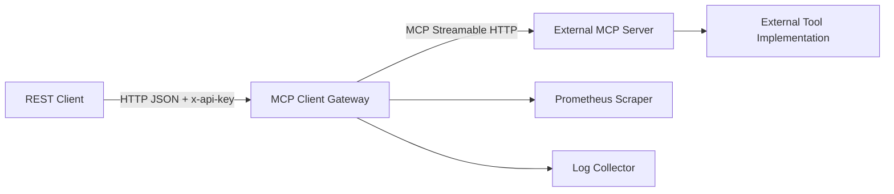
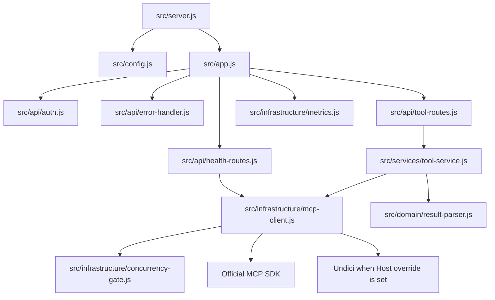
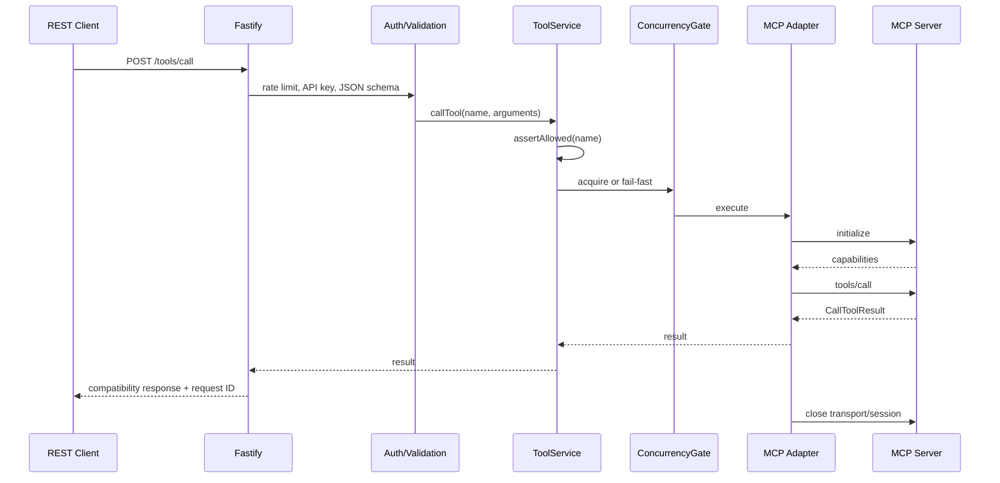

# Arsitektur Sistem

## Tujuan

MCP Client Master Gateway menerjemahkan REST API menjadi operasi Model Context
Protocol (MCP) melalui Streamable HTTP. Gateway memungkinkan client yang tidak
mengimplementasikan MCP untuk melakukan discovery dan eksekusi tool melalui
kontrak HTTP JSON yang stabil.

## Context



Trust boundary berada pada HTTP ingress gateway dan koneksi egress ke MCP server.
TLS, external identity, WAF, dan distributed rate limit berada di luar process ini
dan sebaiknya disediakan reverse proxy atau platform.

## Karakteristik

- Runtime Node.js 22, ECMAScript modules, dan Fastify.
- Stateless: tidak ada database, cache, session aplikasi, atau filesystem state.
- Satu MCP client, transport, dan session baru untuk setiap operasi upstream.
- Dependency injection melalui `createApp(config, dependencies)` agar test offline.
- Konfigurasi divalidasi sekali sebelum server listen.
- Error internal dipetakan ke error publik bertipe dan tidak membocorkan cause.

## Komponen



### Bootstrap dan app factory

`src/server.js` memuat konfigurasi, membuat aplikasi, listen, dan menangani
`SIGINT`/`SIGTERM`. `src/app.js` menyusun dependency, Fastify hooks, rate limit,
metrics, error handler, dan routes.

Hanya `server.js` yang memanggil `process.exit`. Test dan embedding menggunakan
`createApp` langsung sehingga lifecycle dapat dikendalikan caller.

### API layer

- `auth.js`: memverifikasi `x-api-key` dengan constant-time comparison.
- `schemas.js`: JSON Schema request dan penolakan property tidak dikenal.
- `health-routes.js`: compatibility health, liveness, dan readiness.
- `tool-routes.js`: mapping HTTP ke use case dan response legacy.
- `error-handler.js`: satu mapping exception ke error envelope publik.

Route tidak membuat transport MCP secara langsung. Route hanya menangani HTTP,
validasi, dan serialisasi.

### Service layer

`ToolService` menerapkan allowlist sebelum adapter dipanggil, mengubah hasil
discovery tools/prompts/resources ke contract API, menyediakan shortcut
`simulate_router_path`, mengeksekusi plan step-by-step via MCP, resolve
placeholder `result:*`, dan memakai result parser untuk compatibility.

Allowlist berada di service agar tidak dapat dilewati oleh route baru yang memakai
service yang sama.

### MCP adapter

`McpClientAdapter` adalah satu-satunya modul yang bergantung pada MCP SDK:

1. Memeriksa concurrency gate.
2. Membuat `StreamableHTTPClientTransport`.
3. Membuat MCP `Client`.
4. Melakukan `connect`, yang mencakup initialize handshake.
5. Menjalankan `listTools`, `listPrompts`, `listResources`, `readResource`,
   `getPrompt`, `callTool`, `discoverServer`, atau probe.
6. Menutup client pada blok `finally`.
7. Memetakan timeout dan kegagalan upstream ke domain error.

List tools/prompts/resources mengikuti pagination sampai `nextCursor` kosong.

Discovery bootstrap melakukan `GET /health` ke upstream lebih dulu, lalu mencoba
transport utama `/mcp`. Bila initialize pada jalur utama gagal, adapter mencoba
fallback `POST /api/mcp` dan `GET /api/mcp/stream?sessionId=<id>`. Strategy yang
berhasil terakhir diprioritaskan pada operasi berikutnya untuk mengurangi churn.
Operator juga dapat memaksa `primary` atau `fallback` melalui
`MCP_TRANSPORT_MODE`.

### HTTP transport, fallback, dan custom Host

Tanpa `MCP_HOST_HEADER`, adapter memakai standard Node `fetch`. Bila
`MCP_HOST_HEADER` diisi, adapter memakai `undici.request` karena standard fetch
menghitung ulang header `Host`. Response Undici dibungkus sebagai Web `Response`
agar sesuai interface transport MCP SDK.

Header auth upstream tambahan berasal dari config operator:

- `MCP_AUTHORIZATION` untuk deployment bearer token atau skema lain pada
  `Authorization`;
- `MCP_SECRET_HEADER` + `MCP_SECRET_VALUE` atau alias
  `MCP_UPSTREAM_SECRET_HEADER` + `MCP_UPSTREAM_SECRET` untuk secret header seperti
  `x-mcp-secret`.

Pada mode fallback, SDK client tetap memakai `StreamableHTTPClientTransport`, tetapi
fetch dibungkus agar request `POST/DELETE` diarahkan ke `MCP_FALLBACK_POST_URL`
sedangkan `GET` SSE diarahkan ke `MCP_FALLBACK_STREAM_URL?sessionId=<id>`.

Perubahan pada jalur ini wajib menjalankan real transport contract test; mock tidak
dapat membuktikan header benar-benar terkirim.

### Concurrency gate

`ConcurrencyGate` membatasi operasi upstream aktif per process. Bila limit tercapai,
request baru langsung mendapat `MCP_CONCURRENCY_LIMIT`/503; request tidak diantrikan.
Desain fail-fast mencegah antrean in-memory tanpa batas dan menjaga latency dapat
diprediksi.

Limit bersifat per process. Bila menjalankan beberapa process/replica, total potensi
concurrency adalah:

```text
total maksimum = jumlah process × MCP_MAX_CONCURRENCY
```

### Metrics dan logging

Metrics hook mencatat active request, total request, dan latency per method/route/
status. Fastify/Pino menulis JSON log dengan request ID. Header authorization dan
API key tidak diserialisasi sebagai nilai log. Execution plan menambah audit log
per step berisi `planId`, `sessionId`, `page`, `stepIndex`, `tool`, durasi, dan
status hasil. Gateway juga menulis log lifecycle per route dan debug log adapter/
service agar investigasi timeout, fallback transport, auth failure, dan shutdown
lebih mudah tanpa membuka payload mentah.

## Alur request tool



Penolakan auth, schema, allowlist, rate limit, atau concurrency terjadi sebelum
tool dieksekusi. Concurrency diperiksa sebelum koneksi MCP dibuat.

## Timeout model

Ada dua fase timeout:

- Connect timeout membatasi initialize handshake.
- Request timeout membatasi `listTools` dan `callTool`.

Fetch transport juga diberi abort signal. MCP SDK request timeout (`-32001`), Web
Abort/Timeout error, Undici connect timeout, dan `ETIMEDOUT` dipetakan ke 504.
Kegagalan lain dipetakan ke 502.

Tidak ada retry otomatis. Gateway tidak mengetahui idempotency tool; retry generic
call dapat menggandakan side effect.

## Normalisasi hasil

Kontrak legacy mengikuti truthiness Python lama:

- non-empty `structuredContent` menjadi mode `structured`;
- empty object/array/string masuk fallback mode `text`;
- hanya content item dengan `type: "text"` masuk `parsed_result.data.texts`;
- content asli tetap tersedia pada `/tools/call`;
- `isError` mengubah `ok` menjadi `false`, tetapi HTTP tetap 200.

Perilaku ini sengaja dipertahankan oleh contract test. API versi baru diperlukan
untuk mengubah semantik tersebut tanpa mematahkan consumer.

## Graceful shutdown

Saat menerima `SIGINT` atau `SIGTERM`, server:

1. Mencatat signal.
2. Berhenti menerima koneksi baru.
3. Menunggu request aktif selesai.
4. Menutup koneksi keep-alive idle (`forceCloseConnections: "idle"`).
5. Keluar dengan status 0; failure saat close menghasilkan status 1.

Timeout stop platform harus lebih panjang daripada timeout request MCP maksimum
atau kebijakan harus secara eksplisit menerima request yang terputus.

## Scaling

Karena stateless, replica dapat ditambah secara horizontal. Perhatikan:

- rate limit dan concurrency limit bersifat lokal per process;
- readiness setiap replica melakukan handshake terpisah;
- MCP server harus mampu menangani gabungan concurrency seluruh replica;
- session reuse belum digunakan dan tidak boleh ditambahkan tanpa load/contract test;
- sticky session tidak diperlukan oleh gateway karena session hanya hidup selama
  satu operasi.

## Non-goals

- Menjadi MCP server.
- Menyimpan atau mengubah definisi tool.
- Menjalankan LLM atau agent loop.
- Menyediakan distributed auth/rate limit.
- Menyediakan retry/circuit breaker otomatis.
- Menjadi source of truth topologi router.
