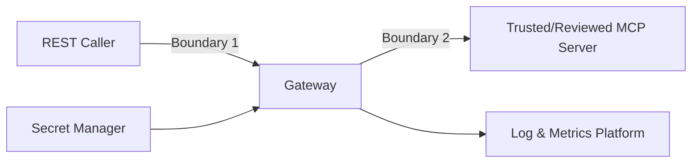

# Keamanan

## Security objectives

- Hanya caller terotorisasi yang dapat menjalankan tool.
- Caller tidak dapat menjalankan tool di luar allowlist.
- Kegagalan upstream tidak membocorkan detail internal.
- Resource gateway dan MCP server dibatasi.
- Secret tidak masuk Git, image, response, log, atau metric.

## Trust boundaries

Input caller, MCP response, dan exception upstream tetap harus dianggap tidak
terpercaya. MCP server harus direview karena tool dapat memiliki side effect.

## Controls

### Authentication

Static API key dibaca dari `API_KEY` dan dibandingkan constant-time terhadap
`x-api-key`. Auth terjadi sebelum adapter pada route MCP.

Keterbatasan:

- satu shared secret, tanpa identity atau role;
- tidak ada expiry/rotation protocol bawaan;
- auth mati bila value kosong;
- transport TLS berada di luar gateway.

Production wajib mengisi API key dan memakai TLS/reverse proxy atau private trusted
network. OAuth2/JWT/mTLS memerlukan desain dan ADR baru.

### Authorization

`ALLOWED_TOOLS` adalah exact-name allowlist. `ToolService.assertAllowed` berjalan
sebelum MCP adapter. Default hanya `simulate_router_path`.

`GET /tools` tetap menampilkan seluruh tool upstream. Jangan menganggap discovery
response sebagai authorization grant.

### Resource controls

- Body size limit mencegah payload besar tanpa batas.
- Rate limit membatasi request per process/client view.
- Concurrency gate membatasi operasi MCP aktif.
- Connect dan request timeout membatasi resource lifetime.
- Fail-fast 503 mencegah queue in-memory tumbuh tanpa batas.

### Information disclosure

- Public error envelope tidak membawa cause/stack/socket detail.
- Header API key/authorization direduksi/tidak diserialisasi pada log.
- Metric label tidak memasukkan user input.
- `.env` dan log di-ignore.

Risiko tersisa: `/health` dan `/simulate-path` compatibility response mengekspos
MCP URL, sedangkan `/health` tidak memakai auth. Batasi di reverse proxy atau
migrasikan consumer ke endpoint production sebelum menghapusnya.

### Custom Host header

`MCP_HOST_HEADER` hanya berasal dari operator config dan diteruskan melalui Undici.
Jangan mengambil Host override dari request caller; hal tersebut dapat membuka SSRF,
virtual-host confusion, atau routing ke tenant yang salah.

## Threat model ringkas

| Threat | Control | Residual risk |
|---|---|---|
| Unauthorized tool execution | API key | Shared key dapat tersebar; auth kosong menonaktifkan control |
| Tool privilege escalation | Exact allowlist | Salah klasifikasi tool oleh operator |
| Brute force/DoS | rate/body/concurrency/timeout | Limit lokal, bukan distributed |
| SSRF ke arbitrary MCP | URL hanya dari env | Operator/config compromise |
| Secret leak via error | typed error envelope | Internal logs masih perlu access control |
| Secret leak via logs | redaction dan no body logging | Future custom logs dapat melanggar aturan |
| Duplicate mutating action | no automatic retry | Caller dapat retry sendiri tanpa idempotency |
| Upstream malicious payload | SDK validation + response mapping | Resource-heavy valid payload tetap mungkin |
| Legacy config disclosure | documented deprecated endpoint | Tetap terbuka sampai migration selesai |

## Secret handling

- Jangan commit `.env`.
- Permission environment file systemd maksimum `0640`, owner root, group service.
- Gunakan Docker/Kubernetes secret atau platform secret manager.
- Rotasi dilakukan dengan update secret dan rolling restart; koordinasikan caller.
- Jangan mengirim API key melalui query string.
- Jangan menampilkan key pada command history, CI output, atau support ticket.

## Tool onboarding checklist

Sebelum menambah nama tool ke allowlist:

- Identifikasi owner dan purpose.
- Simpan schema input/output resmi.
- Klasifikasikan read-only atau mutating.
- Dokumentasikan side effect dan data sensitivity.
- Tentukan idempotency dan timeout normal.
- Tinjau authorization yang dibutuhkan.
- Tambahkan test dengan fake adapter; contract test bila tersedia pada test MCP.
- Perbarui API/config/security docs dan changelog.

Mutating tool sebaiknya tidak dibuka melalui shared static key tanpa identity dan
authorization yang lebih kuat.

## Dependency dan supply chain

- Versi production exact dan lock file di-commit.
- Install release memakai `npm ci`, bukan floating install.
- Audit dependency dijalankan saat dependency berubah dan sebelum release.
- Container final memakai production dependency dan non-root user.
- CI action/version dan base image perlu direview/diupdate berkala.

Audit tanpa vulnerability bukan jaminan aman; tetap review changelog dependency dan
MCP SDK breaking/security advisory.

## Security change requirements

Perubahan auth, allowlist, secret, error detail, Host header, proxy trust, atau
resource limit wajib memiliki:

- threat/risk explanation;
- negative test (unauthorized/blocked/leak prevention);
- docs update;
- changelog;
- rollout dan rollback plan;
- approval pemilik sistem.

## Pelaporan vulnerability

Jangan membuka issue publik berisi secret, internal URL, exploit payload produksi,
atau data customer. Gunakan kanal security internal organisasi dan sertakan versi,
request ID/log yang telah disanitasi, impact, serta langkah reproduksi minimal.
